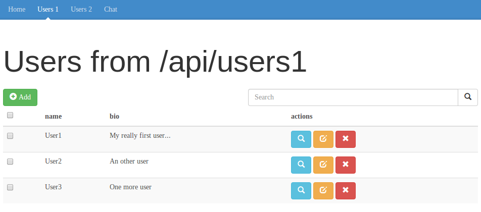
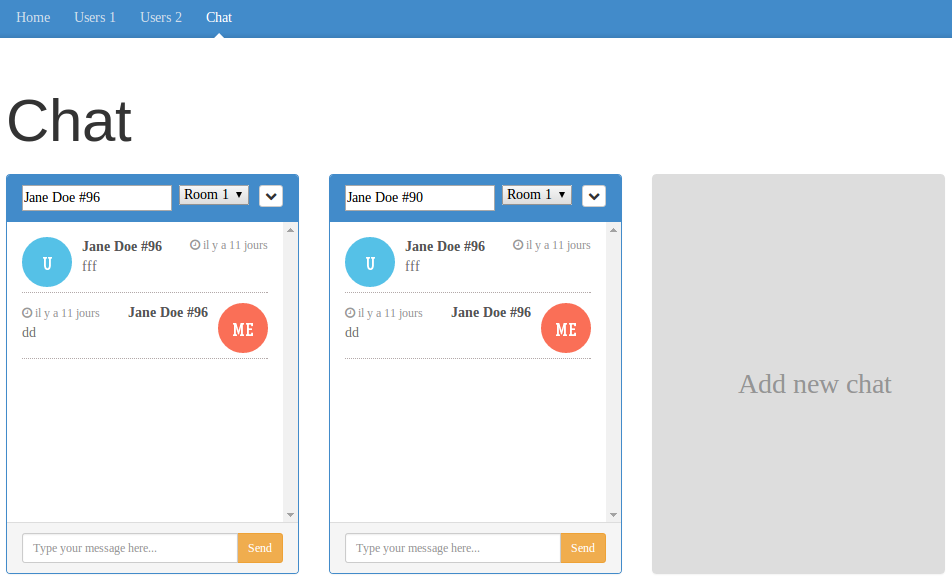

#### WORK IN PROGESS

# Simple CRUD : play / mongo / angular

This app aims to show how to design a simple CRUD application using Play framework (and Scala) for a REST API backend and AngularJS for the frontend.
It uses news tools for productivity such as grunt and bower.

## Screenshots

CRUD :

Chat :

## Setup

This project is using a lot of tools. All should be installed before starting to run it.

- [MongoDB 2.4.8](https://www.mongodb.org/)
- [Scala 2.10.2](http://www.scala-lang.org/)
- [Play framework 2.2.3](http://www.playframework.com/)
- [nodejs 0.10.26](http://nodejs.org/) and npm 1.3.11
- [bower 1.3.3](http://bower.io/) (`sudo npm install -g bower`)
- [grunt-cli 0.1.13](http://gruntjs.com/) (`sudo npm install -g grunt-cli`)

Versions of used libraries :

- [ReactiveMongo 0.10.0](http://reactivemongo.org/)
- [AngularJS 1.2.16](http://angularjs.org/)
- [Bootstrap 3.1.1](http://getbootstrap.com/)

Feel free to send a pull request to upgrade versions...  
(I will try to stay as up to date as possible)

## Getting started

- Open a terminal and go to the root app folder
- `mkdir app/views` to create the folder views for Play
- `cd ui` go to ui/ folder to setup frontend tools
- `npm install` to install all grunt dependencies
- `bower install` to install all bower dependencies
- `grunt play` to build project and generate play files
- Start mongodb
- `cd ..` go to root folder
- `play run` to launch the application in play server
- Go to [localhost:9000](http://localhost:9000/) to see the application

## Development

When you develop with this configuration, you should have at least two terminals opened. One for play (backend) and one for grunt (frontend).

- Go to folder ui/ and run `grunt dev`. It will launch a watch to sync your frontend files in play.
- Go to root folder and run `play run`. It will start the play server.

## TODO

- write tests !!! (Scala & AngularJS)
- finalize scala rest apis (improve actual code, remove deprecated code)
- add a REST api with [play-autosource](https://github.com/mandubian/play-autosource)
- work with more complex objects (nested objects, arrays, options) & add metadata (createDate...)
- improve REST apis & UI (pagination, searches...)
- add global CRUD actions (delete all / delete selected...)
- add authentication and private views

## Credits

I take some code & inspiration in various projects and articles. Bests are :

- [Eventual activator](https://github.com/angyjoe/eventual) from Typesafe
- [Reactive app](https://github.com/sgodbillon/reactivemongo-demo-app) from Stephane Godbillon
- [JSON Coast-to-Coast Design](http://mandubian.com/2013/01/13/JSON-Coast-to-Coast/) from Mandubian
- [angular-play-mongo-sample](https://github.com/loicdescotte/angular-play-mongo-sample) from Loïc Descotte
- [SSE chat](https://github.com/matthiasn/sse-chat/) from Matthias Nehlsen
